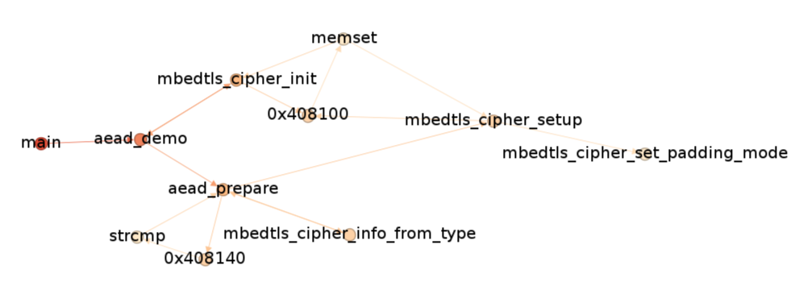

# binpaths
Use `angr` to find execution paths that lead to a certain symbol or address in the binary,
then print the paths, or export the relevant part of control flow graph to GraphML file.

If the binary is built with debug, pass `--src-dir=... --ctx-lines=3` to get (somewhat) relevant source for each step when printing paths.

Can be used with executables, dynamic and static libraries. Only tested on Linux.

## Usage
```
$ ./binpaths.py --help
usage: binpaths.py [-h] --entry ENTRY --step STEP [--avoid AVOID] [--avoid-re AVOID_RE]
                   [--src-dir SRC_DIR] [--src-glob SRC_GLOB] [--ctx-lines CTX_LINES] [--demangle]
                   [--demangle-cut-args] [--cfg-out-full CFG_OUT_FULL] [--cfg-out-full-fun-only]
                   [--cfg-out CFG_OUT] [--cfg-out-fun-only] [--reverse-search] [--keep-dead-ends]
                   [--paths-out PATHS_OUT] [--paths-out-fun-only] [--connect-same-addr]
                   binfile

find execution paths leading to a certain point and print or export them to GraphML

positional arguments:
  binfile               binary file to analyze

options:
  -h, --help            show this help message and exit
  --entry ENTRY         name of entry point symbol or entry point address in hex, not neccessarily
                        real entry point
  --step STEP           regex for node name that expresses a mandatory step in execution path.Must
                        pass at least two --step args to describe source and destination of the path.
                        Steps in the middle (if any) will be required to be somewhere in the path in
                        the same order
  --avoid AVOID         symbol or address in hex to avoid in execution. Use several --avoid args if
                        needed
  --avoid-re AVOID_RE   regex for node name to avoid in results. Use several --avoid-re args if
                        needed
  --src-dir SRC_DIR     sources directory, can be specified more than once. Use several --src-dir
                        args if needed
  --src-glob SRC_GLOB   glob to limit source files from src-dir e.g. *.c, *.cpp
  --no-src              Do not try to match with sources or show debug info
  --ctx-lines CTX_LINES
                        how many lines of surrounding context to show with sources
  --demangle            try to revert C++ name mangling for symbols
  --demangle-cut-args   cut arguments from demangled C++ symbols, implies --demangle
  --cfg-out-full CFG_OUT_FULL
                        file to store full control flow graph
  --cfg-out-full-fun-only
                        when saving control flow graph, treat all offsets in a function as the same
                        node
  --cfg-out CFG_OUT     file to store control flow graph part that passes through --step args
  --cfg-out-fun-only    when saving filtered control flow graph, treat all offsets in a function as
                        the same node
  --reverse-search      walk CFG from last step to first step. Depending on graph shape can save a
                        lot of time
  --keep-dead-ends      keep dead end paths in CFG. Useful to see sources or destinations (with
                        --reverse-search) you didn't think of
  --paths-out PATHS_OUT
                        file to store paths graph where same nodes in different paths are treated as
                        different nodes
  --paths-out-fun-only  when saving paths graph, treat all offsets in a function as the same node
  --connect-same-addr   connect same address nodes in CFG even if they represent different call
                        contexts. Mostly to work around angr not seeing a path that is definitely
                        there
  ```

## What leads to mbedtls_cipher_set_padding_mode in mbedtls demo app?
```shell
$ ./binpaths.py --entry=main --step='main([+].*)?' --step='mbedtls_cipher_set_padding_mode' \
    --reverse-search --connect-same-addr \
    --cfg-out=cfg.graphml --cfg-out-fun-only \
    mbedtls/programs/cipher/cipher_aead_demo
...
# angr reports a few errors
...
----------------------------------------------------------------------
-> main+0x2b
-> aead_demo
-> aead_demo+0x25
-> aead_prepare
-> 0x408140
-> strcmp
-> aead_prepare+0x2a
-> aead_prepare+0x45
-> 0x408140
-> strcmp
-> aead_prepare+0x5b
-> aead_prepare+0x73
-> 0x408140
-> strcmp
-> aead_prepare+0x89
-> aead_prepare+0xa1
-> 0x408140
-> strcmp
-> aead_prepare+0xb7
-> aead_prepare+0xbb
-> aead_prepare+0xe8
-> mbedtls_cipher_info_from_type
-> mbedtls_cipher_info_from_type+0x2e
-> mbedtls_cipher_info_from_type+0x3b
-> mbedtls_cipher_info_from_type+0x40
-> aead_prepare+0xf2
-> mbedtls_cipher_setup
-> mbedtls_cipher_setup+0x1e
-> 0x408100
-> memset
-> mbedtls_cipher_setup+0x34
-> mbedtls_cipher_setup+0x42
-> mbedtls_cipher_setup+0x5e
-> mbedtls_cipher_set_padding_mode
-----------------------------------------------------------------------
-> main+0x2b
-> aead_demo
-> mbedtls_cipher_init
-> mbedtls_cipher_init+0x22
-> aead_demo+0x25
-> aead_prepare
-> 0x408140
-> strcmp
-> aead_prepare+0x2a
-> aead_prepare+0x45
-> 0x408140
-> strcmp
-> aead_prepare+0x5b
-> aead_prepare+0x73
-> 0x408140
-> strcmp
-> aead_prepare+0x89
-> aead_prepare+0xa1
-> 0x408140
-> strcmp
-> aead_prepare+0xb7
-> aead_prepare+0xbb
-> aead_prepare+0xe8
-> mbedtls_cipher_info_from_type
-> mbedtls_cipher_info_from_type+0x2e
-> mbedtls_cipher_info_from_type+0x3b
-> mbedtls_cipher_info_from_type+0x40
-> aead_prepare+0xf2
-> mbedtls_cipher_setup
-> mbedtls_cipher_setup+0x1e
-> 0x408100
-> memset
-> mbedtls_cipher_setup+0x34
-> mbedtls_cipher_setup+0x42
-> mbedtls_cipher_setup+0x5e
-> mbedtls_cipher_set_padding_mode
...

```

Binpaths does no layout or rendering of the graph, but you can use [gephi](https://github.com/gephi/gephi) to open / rearrange GraphML files.

Output graph in [gephi](https://github.com/gephi/gephi)


